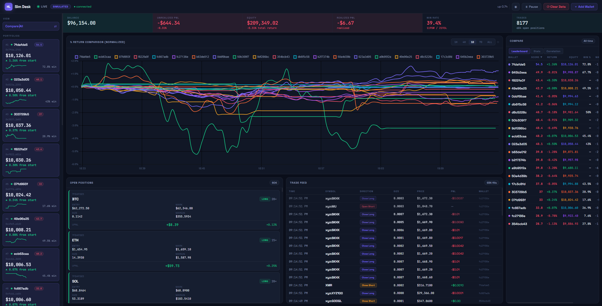

# HL Sim Desk

> **A real-time copy-trading simulation dashboard for Hyperliquid.**
> Monitor any number of wallets simultaneously, each running as an isolated simulated portfolio. No real money, no private key — just data.



---

## Table of Contents

- [What It Does](#what-it-does)
- [Quick Start](#quick-start)
- [Dashboard Overview](#dashboard-overview)
- [How the Simulation Works](#how-the-simulation-works)
  - [Copy Ratio](#copy-ratio)
  - [Position Seeding](#position-seeding)
  - [Fill Handling](#fill-handling)
  - [Equity Formula](#equity-formula)
  - [Risk Controls](#risk-controls)
- [Configuration Reference](#configuration-reference)
- [Wallet Management](#wallet-management)
- [Tearsheet Statistics](#tearsheet-statistics)
- [Architecture](#architecture)
- [Docker](#docker)
- [FAQ](#faq)
- [Disclaimer](#disclaimer)

---

## What It Does

HL Sim Desk connects to any Hyperliquid wallet via WebSocket and mirrors every trade it makes into one or more simulated portfolios — scaled proportionally to a starting balance you choose. Each wallet runs as a completely independent session with its own equity curve, position state, and trade history.

**Key properties:**

| Property | Detail |
|---|---|
| **Zero risk** | Simulation only. No private key required. No orders placed. |
| **Multi-wallet** | Add unlimited wallets; each is a separate simulated portfolio. |
| **Fill-first copy** | Fills (not position snapshots) are the authoritative copy signal, preventing double-copy. |
| **Correct equity** | `equity = free_cash + locked_margin + unrealized_pnl` — equity never drops on trade open. |
| **Copy from now** | Existing positions are seeded at the current mark price, so starting uPnL is always zero. |
| **Fixed ratio** | The copy ratio is locked at session start and never drifts as trades happen. |
| **Persistent** | Wallets, trades, and equity history survive server restarts via SQLite, backed by a daily online backup (`data/backups/`, last 7 kept) so months of retained history survive disk corruption too. |
| **Compare mode** | Switch to normalized % return curves across all wallets with a ranked leaderboard. |

---

## Quick Start

```bash
# 1. Clone and install
git clone <this-repo>
cd Hyperliquid-Copy-Bot
pip install -r requirements.txt

# 2. Configure (optional for first run)
cp .env.example .env
# Edit .env — only TARGET_WALLET_ADDRESS is required; everything else has sane defaults.

# 3. Run
cd src
python web_app.py

# 4. Open the dashboard
# http://localhost:5000
```

> **Note:** Once you add wallets through the UI, the `.env` wallet settings are ignored. The database is the source of truth.

---

## Dashboard Overview

```
┌─────────────────────────────────────────────────────────────────────────┐
│  Header: logo · WebSocket status · theme · pause · clear · add wallet   │
├──────────────┬───────────────────────────────────────────┬──────────────┤
│              │  KPI Strip (6 live metrics)               │              │
│  Sidebar     ├───────────────────────────────────────────┤  Tearsheet   │
│              │                                           │              │
│  Portfolios  │  Equity Curve                             │  Full stats  │
│  ranked by   │  (multi-wallet overlay in Compare mode)   │  panel —     │
│  % return,   │                                           │  right col,  │
│  with        ├─────────────────────┬─────────────────────┤  scrollable  │
│  sparklines  │  Open Positions     │  Trade Feed         │              │
│              │                     │                     │              │
└──────────────┴─────────────────────┴─────────────────────┴──────────────┘
```

### KPI Strip

Six live metrics updating in real-time:

- **Total Equity** — sum across all active wallets
- **Total Realized PnL** — cumulative closed profit/loss
- **Total Unrealized PnL** — mark-to-market value of all open positions
- **Overall Return %** — weighted return since session start
- **Active Wallets** — count of running sessions
- **Total Trades** — fills copied across all wallets

### Sidebar — Portfolio Cards

Each card shows:
- Wallet label + address (truncated)
- Live equity and return %
- Sparkline equity mini-chart
- Status badge (Active / Paused)
- Hover to reveal ✕ (remove) and ⟳ (reset) controls

Cards are ranked by % return, highest first.

### Equity Chart

- **Single-wallet mode:** equity curve over time with balance and uPnL bands
- **Compare mode:** normalized % return curves for all wallets overlaid. Switch via the **Compare** toggle in the header. A ranked leaderboard appears below the chart.

### Open Positions Panel

Live table of all simulated positions across the selected wallet:

| Column | Description |
|---|---|
| Symbol | Asset (e.g. BTC, ETH) |
| Side | LONG / SHORT |
| Size | Position size in base asset |
| Entry | Your simulated average entry price |
| Mark | Current market price |
| Lev | Leverage |
| Margin | Locked collateral |
| uPnL | Unrealized profit/loss |
| % | Return on position |

### Trade Feed

Real-time stream of fills as they happen. Colour-coded: green for longs/wins, red for shorts/losses. Each row shows symbol, direction (Open/Close/Add/Reduce), size, price, notional, and realized PnL where applicable.

---

## How the Simulation Works

### Copy Ratio

When you add a wallet with a starting balance, the bot fetches the target's current total equity from the Hyperliquid API and computes:

```
copy_ratio = your_starting_balance / target_wallet_equity
```

**This ratio is locked for the lifetime of the session.** It never changes as trades happen. This is intentional: if you recomputed from your current balance, later trades would be undersized after a run of wins, and oversized after losses — distorting the comparison.

**Example:** Target has $500,000 equity; you start with $10,000.
```
copy_ratio = 10,000 / 500,000 = 0.02  (2%)
```
Every position the target opens at $50,000 notional becomes $1,000 notional in your sim.

### Position Seeding

When you add a wallet, the target may already have open positions. These are seeded into your sim **at the current mark price**, not at the target's historical entry price. This means:

- Your starting unrealized PnL is always **zero** — you're only tracking profit from when you started watching.
- The target's historical entries are irrelevant for your simulation's starting state.

Seeded positions are scaled by `copy_ratio` and locked-in margin is deducted from your free cash.

### Fill Handling

Fills are the **primary and authoritative copy signal**. The position snapshot channel (`userEvents → positions`) is only used as a safety net for full closes where the fill stream was missed.

This matters because Hyperliquid can fire both channels for the same trade. If you copy from both, you get double-counted fills. By treating fills as the source of truth and making `on_new_position` a no-op, this is avoided entirely.

#### Fill types and what happens to the sim

| Fill Direction | Action |
|---|---|
| `Open Long` / `Open Short` | Opens a new simulated position. Margin deducted from free cash. |
| `Add Long` / `Add Short` | Adds to an existing position. Average entry price is updated. |
| `Close Long` / `Close Short` | Closes the position. PnL realized at fill price. Margin returned. |
| `Reduce Long` / `Reduce Short` | Partially closes. PnL realized proportionally. |
| `Short → Long` / `Long → Short` (flip) | Old side closed first (PnL realized), then new side opened. |

#### PnL calculation on close

```
PnL (long)  = close_size × (fill_price − entry_price)
PnL (short) = close_size × (entry_price − fill_price)
```

Margin proportional to the closed fraction is returned to free cash alongside the PnL.

#### Deduplication

Every fill is keyed by its `tid` (trade ID from Hyperliquid). Duplicate events from reconnects or overlapping subscriptions are silently dropped. The processed-ID set is capped at 50,000 entries to prevent unbounded memory growth; after that it clears and re-deduplicates from the stream.

### Equity Formula

```
equity = free_cash + locked_margin + unrealized_pnl
```

**Why not just `free_cash + unrealized_pnl`?**

When a position opens, margin moves from `free_cash` to `locked_margin`. If you excluded locked margin from equity, your equity would drop every time a trade opened — even though no money was actually lost. Including margin means equity only moves when positions gain or lose value.

```
Before trade open:
  free_cash = $10,000   locked_margin = $0      uPnL = $0
  equity    = $10,000

After opening $1,000 notional at 10× leverage ($100 margin):
  free_cash = $9,900    locked_margin = $100    uPnL = $0
  equity    = $10,000   ← unchanged ✓

After position gains $50:
  free_cash = $9,900    locked_margin = $100    uPnL = $50
  equity    = $10,050   ← only moved because of actual PnL ✓
```

Equity snapshots are written to SQLite every 30 seconds and on every fill event, giving you a continuous chart even between trades. Snapshots older than 30 days are pruned on startup.

### Risk Controls

| Control | Description |
|---|---|
| **Daily loss limit** | If cumulative realized losses in a calendar day exceed `MAX_DAILY_LOSS_USD`, the wallet is automatically paused. Resets at midnight. |
| **Blocked assets** | Assets listed in `BLOCKED_ASSETS` are skipped entirely — no fills copied. |
| **Max open trades** | Caps concurrent simulated positions. New fills for new symbols are dropped if at the cap. |
| **Dust guard** | Notional < $0.01 is skipped (fills that would result in impossibly small positions). |

---

## Configuration Reference

All settings are loaded from `.env` on startup. Once wallets are persisted in the database, the wallet-related `.env` keys are no longer read at runtime — use the UI instead.

| Key | Default | Description |
|---|---|---|
| `TARGET_WALLET_ADDRESS` | — | Single wallet to copy on first start. Seeds the DB on first launch only. |
| `TARGET_WALLETS` | — | Comma-separated list: `0xabc...,0xdef...` Seeds multiple wallets on first start. |
| `WALLET_LABELS` | — | Display names matching `TARGET_WALLETS` order: `Alice,Bob` |
| `SIMULATED_ACCOUNT_BALANCE` | `1000` | Default starting balance ($) for new wallets. |
| `LEVERAGE_ADJUSTMENT` | `1.0` | Scale the target's leverage: `1.0` = match exactly (default), `0.5` = half, `2.0` = double. |
| `BLOCKED_ASSETS` | — | Assets to skip: `BTC,ETH` |
| `MAX_OPEN_TRADES` | `x` | Max concurrent copied positions. `x` = unlimited. |
| `MAX_OPEN_ORDERS` | `x` | Max concurrent copied orders. `x` = unlimited. |
| `MAX_DAILY_LOSS_USD` | `500` | Auto-pause a wallet after this much realized loss in one day. |
| `DATABASE_URL` | `sqlite:///./data/trading.db` | SQLite path. |
| `LOG_LEVEL` | `INFO` | Logging verbosity: `DEBUG`, `INFO`, `WARNING`, `ERROR`. |
| `HYPERLIQUID_API_URL` | `https://api.hyperliquid.xyz` | REST API base URL. |

### Leverage adjustment

The leverage adjustment ratio scales the target's leverage:

```
your_leverage = target_leverage × LEVERAGE_ADJUSTMENT
your_leverage = clamped to [min_leverage, max_leverage]
```

Defaults: `min_leverage = 1.0`, `max_leverage = 10.0`, `adjustment_ratio = 1.0` (mirrors the target's leverage exactly, subject to the per-asset and min/max caps above).

---

## Wallet Management

All wallet management is done through the dashboard UI. No code changes required.

### Add a wallet

Click **＋ Add Wallet** in the header or sidebar. Enter:
- **Address** — the target Hyperliquid wallet address (0x...)
- **Label** — a display name
- **Starting Balance** — your simulated starting balance in USD

The wallet starts monitoring immediately and persists across server restarts.

### Remove a wallet

Hover a portfolio card in the sidebar and click **✕**. This permanently deletes:
- The wallet entry from the registry
- All its trade records
- All its equity snapshots

### Reset a wallet (⟳)

Resets the wallet to its original starting balance and wipes all trade history and equity data. The equity chart restarts from zero. The copy ratio is recomputed from the target's current equity. Useful for backtesting a "what if I started today" scenario.

### Pause / Resume

Pauses or resumes copying fills for a wallet without removing it. Paused wallets still appear in the dashboard with their existing state frozen. The **Pause All** button in the header does this for every wallet at once — it toggles to **Resume All** once every wallet is paused.

---

## Tearsheet Statistics

The right-hand tearsheet panel shows a full performance breakdown for the selected wallet. All stats are computed from the SQLite trade and equity history.

### Performance

| Stat | How it's computed |
|---|---|
| **Win Rate** | `wins / (wins + losses) × 100` |
| **Record** | `W-L` trade count |
| **Profit Factor** | `gross_wins / abs(gross_losses)` — > 1.0 means profitable overall |
| **Total Realized PnL** | Sum of all closed trade PnL |
| **Avg Win / Avg Loss** | Mean PnL across winning / losing trades |
| **Best / Worst Trade** | Max and min single-trade PnL |
| **Expectancy** | `avg_win × win_rate + avg_loss × loss_rate` — expected $ per trade |

### Risk

| Stat | How it's computed |
|---|---|
| **Max Drawdown** | Largest peak-to-trough equity decline (%) |
| **Current Drawdown** | Current equity vs all-time equity high (%) |
| **Sharpe Ratio** | Annualised daily-return Sharpe (252 trading-day annualisation, no risk-free rate) |
| **Calmar Ratio** | `total_return_pct / abs(max_drawdown_pct)` |
| **Volatility** | Annualised standard deviation of daily equity returns (%) |
| **Win Streak** | Longest consecutive winning trades |

### Activity

| Stat | Description |
|---|---|
| **Total Trades** | All fills recorded |
| **Avg Leverage** | Mean leverage across all fills |
| **Current Exposure** | Sum of locked margin across open positions |
| **Avg Trade PnL** | Mean PnL per closed trade |

### Charts in the tearsheet

- **Daily PnL bar chart** — realized PnL grouped by calendar day. Green = net positive day, red = net negative.
- **Rolling 50-trade win rate** — win rate computed over a sliding 50-trade window; shows whether the wallet's edge is improving or degrading.
- **PnL histogram** — distribution of individual trade PnL bucketed into 20 equal-width bins.
- **Rolling 7-day Sharpe** — rolling Sharpe computed over 7-day windows from daily equity snapshots.
- **Top Assets** — the 5 most-traded symbols by trade count, with total notional volume.
- **Per-symbol PnL** — realized PnL broken down by asset (top 15 by absolute PnL).

### Wallet Score

A composite 0–100 quality score computed as:

```
score = sharpe_score × 35%
      + calmar_score × 25%
      + win_rate_score × 20%
      + consistency_score × 20%
```

Where each component is normalized to a 0–100 range:
- Sharpe: −2 → 0, 3 → 100
- Calmar: −1 → 0, 5 → 100
- Win rate: 30% → 0, 70% → 100
- Consistency: inverse of rolling Sharpe standard deviation (stable > volatile)

Higher scores indicate better copy candidates. The score is informational — it has no effect on the simulation.

The score feeds an automated **COPY / MONITOR / SKIP / INSUFFICIENT DATA** decision (`_compute_decision` in `web/stats.py`), surfaced on each wallet's dashboard as a gauge card: a speedometer-style arc (red 0–34 / yellow 35–64 / green 65–100) plus the decision reasons, sample-size confidence, week-over-week trend, and % of profitable trading days. It refreshes automatically alongside the rest of the tearsheet and is display-only — same as the score, it never changes how the simulation copies trades.

---

## Architecture

```
src/
├── web_app.py               # Flask routes + SocketIO server + asyncio bridge (entry point)
├── web/
│   ├── db.py                # SQLAlchemy models (wallets, web_trades, web_equity) + all DB helpers
│   ├── sim.py               # WalletSession dataclass, copy callbacks, session lifecycle
│   └── stats.py             # compute_stats() — all analytics derived from DB records
├── copy_engine/
│   ├── monitor.py           # WebSocket wallet monitor (fills, positions, reconnect loop)
│   └── position_sizer.py    # Leverage calculation + per-asset caps
├── hyperliquid/
│   ├── client.py            # REST API client (multi-dex, retry, get_all_mids)
│   ├── websocket.py         # WebSocket client (heartbeat, auto-reconnect, fill replay on reconnect)
│   └── models.py            # Dataclasses: Position, Fill, WalletState
├── config/settings.py       # Pydantic settings loaded from .env
├── templates/index.html     # Dashboard HTML (single page)
└── static/dashboard.js      # All frontend logic (charts, SocketIO, UI state)
```

### Key design decisions

**Fill-first copy signal**
`on_new_position` is a deliberate no-op. Only `on_order_fill` copies trades. The position snapshot channel is a safety net for rare full-close misses only. This prevents double-copying the same trade from two channels.

**Single asyncio loop**
One asyncio event loop runs in a background thread, bridged to Flask via a thread-safe queue. Each wallet's WebSocket monitor runs as a coroutine inside this shared loop. SocketIO emissions are marshalled back to Flask's thread via `emit_fn`.

**Per-session copy ratio**
The `copy_ratio` is stored on `WalletSession`, not read from settings. This ensures wallets added at different times with different target equities never share or pollute each other's ratio.

**Stale-snapshot guard**
`_reinit_session` (the reset path) purges equity snapshots twice: once before and once after the async network calls that re-seed positions. The second purge catches any snapshot rows written by `_periodic_equity_snapshot` while the network calls were in flight — those rows would contain stale equity values and corrupt the chart after a reset.

**Processed-fill dedup**
Each session maintains a `_processed_fill_ids` set. Fills with a known `tid` are deduplicated. The set is capped at 50,000 entries; beyond that it is cleared (a brief duplicate window is acceptable vs unbounded memory growth).

**SQLite schema**

Three tables:

| Table | Purpose |
|---|---|
| `wallets` | Wallet registry — persists address, label, start balance across restarts |
| `web_trades` | Every fill copied, with `realized_pnl` attached when the position closes |
| `web_equity` | Equity snapshots every 3 seconds + on every fill. Kept forever (never pruned) — history queries downsample in SQL rather than limiting retention, so the chart stays fast without losing data. |

---

## Docker

```bash
# Start
docker-compose up -d

# Logs
docker-compose logs -f

# Stop
docker-compose down
```

The SQLite database and logs are mounted as volumes so they survive container rebuilds.

---

## FAQ

**Does this place real orders?**
No. The bot only reads the target wallet's public fill stream and mirrors it into an in-memory/database position — there is no order-signing or order-submission code path anywhere in the project. No signing, no API key, no real orders — ever.

**Does it need my private key?**
No. All it needs is a target wallet address to watch. Everything is read-only from the public Hyperliquid API.

**Why does equity not drop when a trade opens?**
Because margin is collateral, not a cost. See [Equity Formula](#equity-formula). This is correct behaviour — it matches how real exchange equity works.

**Why is the copy ratio fixed and not updated as my balance grows?**
A fixed ratio makes the simulation deterministic and comparable across time. If the ratio drifted with your balance, a run of wins would make later copies smaller and a run of losses would make them larger — distorting the performance picture.

**What happens if the WebSocket disconnects?**
The WebSocket client has an auto-reconnect loop with exponential backoff. On reconnect it replays any fills missed during the outage from the Hyperliquid fill history endpoint, so gaps in the feed are backfilled.

**Can I copy a vault (not just a wallet)?**
Yes. Vaults expose the same WebSocket fill stream as regular wallets. Enter the vault address the same way you would a wallet address.

**What does "Copy from now" mean exactly?**
When you add a wallet, any positions the target already has are seeded into your sim at the **current mark price**, not their historical entry. Your starting unrealized PnL is therefore zero. You only track profit from the moment you added the wallet — not from whenever the target originally entered.

---

## Disclaimer

This software simulates copy trading for analysis and research purposes only. It does not place real orders, hold any funds, or interact with the blockchain in any write capacity. Historical simulation results do not guarantee future performance. Use at your own risk.
